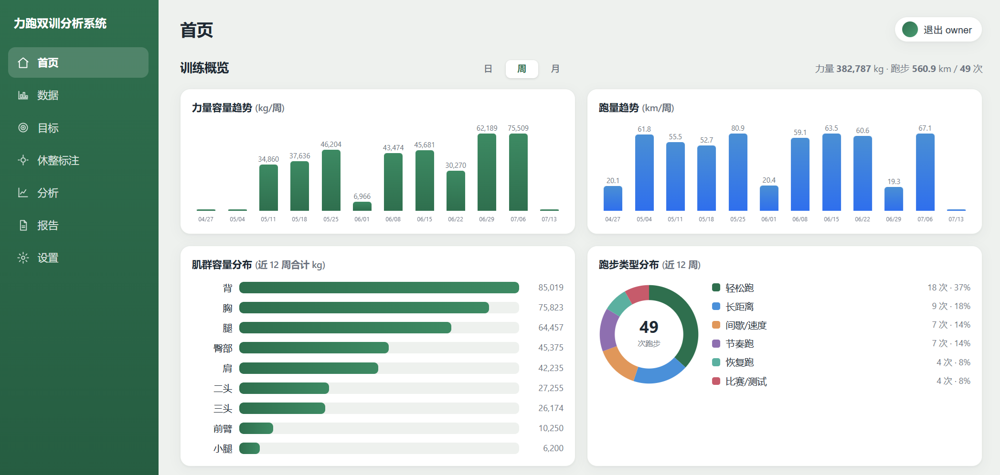
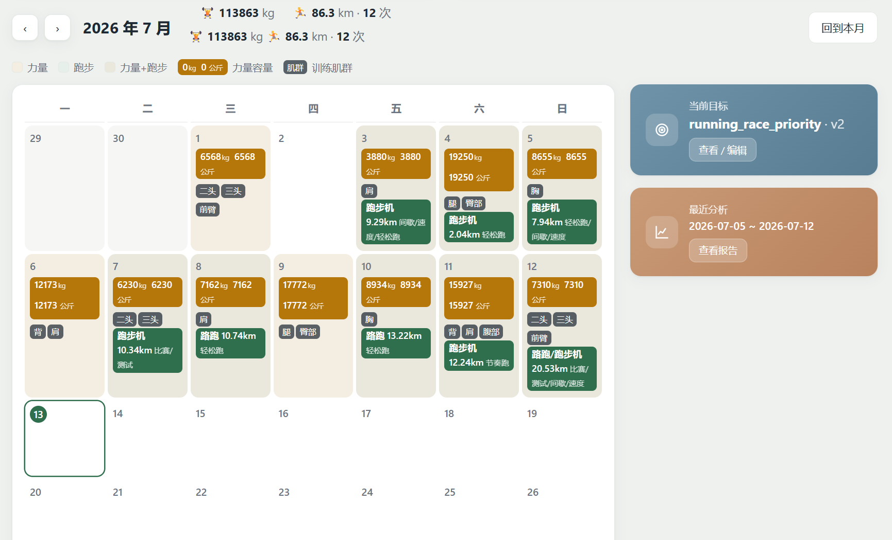

# 力跑双训分析系统

力量 + 跑步双线训练分析 demo。整合**训记**(力量)与 **Garmin**(跑步)数据,基于当前目标配置和休整标注,生成可存档的双线分析报告,识别冲突/过量风险并给出方向性建议。

当前版本: **v0.4.0**
交接/现状速览: [docs/HANDOVER.md](docs/HANDOVER.md)
需求/术语背景: [CONTEXT.md](CONTEXT.md)

---

## 这是什么

这个项目的核心目标不是做一个“大而全”的运动平台,而是把**力量训练**和**跑步训练**这两条原本割裂的数据线拉到一起,让分析不再只看单边。

在此基础上,系统补了一层 AI 能力,但坚持几条边界:

- AI 只在**用户主动触发**时调用
- AI **不修改运动数据**
- 报告是**快照**,底层变化后通过「重新分析」出新版本
- 系统只给**方向性建议**,不扮演医疗或完整教练角色

---

## v0.4 亮点

- **对外只读 API v1**: 9 个 `/api/v1/*` 端点 (meta/context/days/goals/reports/muscle-map/rest-notes), Bearer `srda_` Key 鉴权, 按 user_id 隔离, 只读存量、不触发 LLM。owner 可签发/吊销 Key (`/settings/api-keys`)。已部署并完成真实云端调用验证。
- **外部 Agent 调用支持**: `skills/strength-running-readonly-api` 提供标准 Agent Skill 与通用 LLM 指令文档, 外部 Agent 可通过 curl 只读消费平台训练数据。
- **站点 favicon**: 分享卡片品牌图标复用为全站网页图标。

## v0.3 亮点

- **单日训练分享卡片**: 每日详情页一键生成 3:4 竖版分享图,只呈现训练内容(力量部位 + 跑步核心数据),不含 GPS / 地点 / 动作明细 / AI 分析; 7 种视觉主题,手动截图分享

## v0.2 亮点

- **AI 目标澄清对话**: 多轮聊清训练意图 → 生成结构化草案 → 用户确认后落成新目标版本
- **AI 报告浅追问**: 就当前报告继续自然语言追问,问答挂在报告下持久化
- **温度—心率热负荷解读**: 户外跑按气温分热档,高温心率偏高时提示“可能是热负荷而非强度上升”
- **气温手工标注**: 设备没记录温度时,可在活动详情页直接补录
- **首页数据看板**: 日 / 周 / 月粒度切换,12 桶趋势图 + 肌群分布 + 跑步类型环形图(按距离分布)
- **轻量 Markdown 渲染**: 零依赖、转义优先,用于报告叙述层和 AI 对话回复

---

## 界面截图

### 首页数据看板



### 首页月历看板



---

## 主要功能

### 数据接入
- **训记同步**: 后台线程 + 实时进度; 增量 / 全量 / 指定日重拉; 只读镜像
- **Garmin 导入**: 多文件上传; zip → fit 解析; 去重; 场景识别(路跑 / 跑步机 / 操场 / 越野)

### 训练结构化
- **跑步类型分类**: 轻松 / 长距离 / 节奏 / 间歇 / 恢复 / 比赛测试, 基于个人基线自动判定
- **动作肌群映射**: 训记 type 优先 → 关键词 → AI 补全 → 用户订正,并固化复用
- **当前目标配置**: 手动编辑 + 版本化 + 历史版本查看 / 一键复用
- **休整标注**: 记录缺训 / 恢复 / 伤病等解释性信息

### 分析与 AI
- **AI 双线分析报告**: 规则引擎判断 + LLM 叙述增强; 快照存档 + 重新分析
- **AI 目标澄清**: 目标不是直接聊天改数据,而是“对话 → 草案 → 确认落库”
- **AI 浅追问**: 只解释当前报告,不跨报告、不回写训练数据

### 首页与可视化
- **首页月历看板**: 力量(容量 kg + 肌群标签)、跑步(类型 + 距离); 翻月; 点进每日详情
- **首页数据看板**: 日 / 周 / 月三档切换,力量容量趋势、跑量趋势、肌群容量分布、跑步类型分布(按距离)

---

## 技术栈

- Python 3.14
- FastAPI
- Jinja2
- SQLite (`var/app.db`)
- 原生 HTML / CSS / JS
- 可选云端 LLM (OpenAI 兼容,当前接 DeepSeek)

**额外说明**:
- 不引大型 UI 组件库
- 不引第三方图表库
- Markdown 渲染与饼图均为**零依赖自写**

---

## 本地运行

```bash
pip install -r requirements.txt
cp .env.example .env        # 按需修改 OWNER_PASSWORD 等
python -m uvicorn app.main:app --host 127.0.0.1 --port 8000
```

打开 <http://127.0.0.1:8000> ,用 `.env` 里的 `OWNER_USERNAME` / `OWNER_PASSWORD` 登录。首次启动自动建库并预置 owner。

---

## 首次使用路径

1. **设置** → 用户档案 / 凭证 (训记 Key、LLM Key,可点「测试可用性」)
2. **数据** → Garmin: 上传 Garmin 原始 zip (支持多文件一次上传,自动去重 + 跑步类型分类)
3. **数据** → 训记: 配置 Key 后同步力量数据 (后台同步 + 进度条)
4. **数据** → 动作肌群: 对未分类动作做「AI 一键补全」或手动订正
5. **目标** → 配置当前目标,或直接走 AI 目标澄清
6. **休整标注** → 按需记录缺训 / 伤病 / 恢复解释
7. **分析** → 生成报告 → 报告页继续浅追问
8. **首页** → 看月历 / 看趋势图 / 进入每日详情

---

## 配置项 (环境变量)

见 [.env.example](.env.example)。关键项:

- `DATABASE_PATH` / `UPLOAD_DIR` / `LOG_DIR` — 数据与文件位置
- `ENCRYPTION_MASTER_KEY` — 凭证加密主密钥 (生产必须改)
- `ALLOW_PUBLIC_SIGNUP` — 默认 false, demo 不开放注册
- `COOKIE_SECURE` — HTTP 用 false, HTTPS 用 true
- `LLM_BASE_URL` / `LLM_MODEL` — 留空则用规则引擎
- `MAX_UPLOAD_MB` — 上传大小限制

---

## 测试

```bash
python tests/test_end_to_end.py
```

当前回归状态: **164 / 164 checks passed**

覆盖包括:
- 登录 / 鉴权
- Garmin 导入(真实样本) / 去重 / 跑步分类
- 力量 seed / 肌群映射 / 手动订正
- 目标配置 / 历史查看 / 一键复用 / AI 目标澄清
- 凭证可用性判断
- 轻量 Markdown 渲染 + XSS 转义
- 分析报告 / 重新分析 / 浅追问
- 热负荷-心率解读 / 手工标注气温
- 首页月历看板 / 数据看板(日周月 + 跑步类型分布)
- 每日详情 / 各页面渲染 / 登出

---

## 边界 (demo 阶段)

- **训记镜像只读**,不写回
- **分析只读数据**,不修改运动记录
- **报告是快照**,底层变化后通过「重新分析」生成新报告,旧报告保留
- **LLM 仅用户主动触发**,同步/上传不自动分析
- **不做主动教练 / 完整训练计划 / 医疗建议**
- **天气补全(湿度/风等)** 仍是后续项,当前只做 FIT 原生温度 / 手工气温补录

---

## 代码与文档入口

- 交接 / 当前状态: [docs/HANDOVER.md](docs/HANDOVER.md)
- 需求 / 术语 / 背景: [CONTEXT.md](CONTEXT.md)
- 设计文档: [docs/design/](docs/design/)
- ADR: [docs/adr/](docs/adr/)
- 外部 Agent 调用指南: [skills/strength-running-readonly-api/](skills/strength-running-readonly-api/)

---

## 版本

- `v0.1` — P0 核心闭环,51 项测试
- `v0.2` — AI 目标澄清 / 浅追问 / 温度热解读 / 数据看板,113 项测试
- `v0.3` — 单日训练分享卡片(7 种视觉方案,3:4 竖版,隐私过滤),135 项测试
- `v0.4` — 对外只读 API v1 (9 端点, Bearer Key, 按 user 隔离) + 外部 Agent 调用 skill + 站点 favicon, 164 项测试
